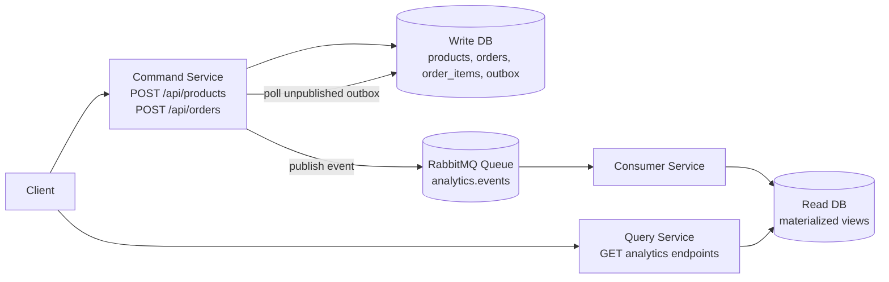

# Data Flow Diagram

```mermaid
flowchart LR
  A[Client] --> B[Command Service\nPOST /api/products\nPOST /api/orders]
  B --> C[(Write DB\nproducts, orders, order_items, outbox)]
  B -->|poll unpublished outbox| C
  B -->|publish event| D[(RabbitMQ Queue\nanalytics.events)]
  D --> E[Consumer Service]
  E --> F[(Read DB\nmaterialized views)]
  A --> G[Query Service\nGET analytics endpoints]
  G --> F
```
